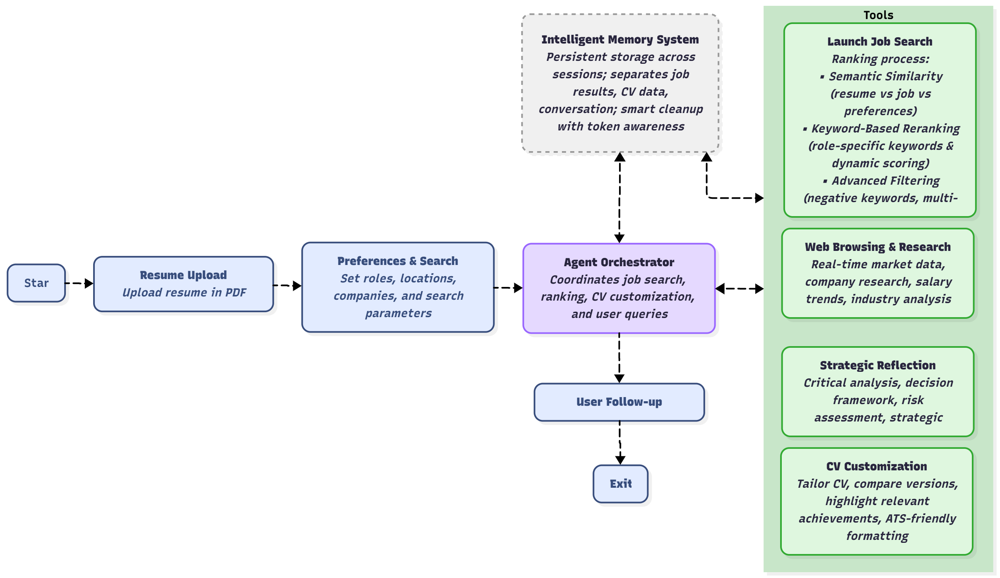

# AI Job Search Agent

An intelligent job search system that combines AI-powered job discovery, job ranking, CV customization, and allow follow up for strategic career planning. The agent uses LangGraph framework with ReAct (Reasoning + Acting) pattern to provide comprehensive job search assistance with memory persistence and follow-up capabilities.

<div align="center">
  
</div>

## 🤖 What This Agent Does

The AI Job Search Agent is a sophisticated system that:

1. **Intelligently Searches Jobs**: Discovers 200+ job openings across LinkedIn, Indeed, and Google Jobs
2. **Ranks with AI**: Uses semantic similarity matching + keyword analysis to find the best matches
3. **Customizes CVs**: Creates tailored resumes for specific job applications with professional PDF output
4. **Maintains Memory**: Remembers job searches and CV customizations for follow-up questions
5. **Researches Strategically**: Browses the web for company research and market analysis
6. **Provides Strategic Insights**: Offers career advice and decision-making support

## 🔍 Job Search Mechanisms

### Multi-Platform Discovery
- **Platforms**: LinkedIn, Indeed, Google Jobs (configurable)
- **Volume**: Searches for 200+ jobs per query
- **Recency**: Focuses on jobs posted in last 72 hours
- **Deduplication**: Removes duplicate jobs across platforms
- **Rate Limiting**: Respectful scraping with delays between requests

### Two-Stage Intelligent Ranking

#### Stage 1: Semantic Similarity Matching
- **Resume Embedding**: Converts your resume to vector using OpenAI text-embedding-3-small
- **Preferences Embedding**: Converts job preferences to vector
- **Job Embedding**: Converts job title + company + location + description to vector
- **Similarity Calculation**: Cosine similarity between vectors
- **Weighted Score**: 70% resume similarity + 30% preferences similarity

#### Stage 2: Keyword-Based Reranking
- **Keyword Extraction**: LLM analyzes your preferred roles to extract relevant keywords
- **Categories**: Core technology, leadership level, domain, industry, skills
- **Enhanced Weights**: Leadership level (50%), Core technology (30%), Domain (15%)
- **Leadership Boost**: 50% score boost for exact leadership term matches
- **Dynamic Scoring**: 
  - Leadership roles: 60% similarity + 40% keywords
  - Other roles: 80% similarity + 20% keywords

### Advanced Filtering System
- **Negative Keywords**: Automatically filters out internships, graduate roles, entry-level positions (can be adjusted)
- **Multi-Field Check**: Searches job title, company and description
- **Transparency**: Shows which jobs were excluded and why

## 📄 CV Customization System

### Complete Workflow
1. **Job Description Fetching**: Retrieves full job description from URL
2. **Requirements Analysis**: LLM extracts technical skills, soft skills, experience level
3. **CV Customization**: Tailors existing CV content to match job requirements
4. **JSON Generation**: Creates structured JSON file with metadata
5. **PDF Generation**: Generates professional PDF using Harvard template
6. **Memory Storage**: Stores CV data for future reference

### Customization Principles
- **No Fabrication**: Never creates false information
- **Minimal Changes**: Only reorders and rephrases existing content
- **Keyword Integration**: Uses job-relevant keywords in existing descriptions
- **Structure Preservation**: Maintains exact JSON structure
- **Truthfulness**: All content remains accurate and verifiable

### Professional PDF Output
- **Harvard Template**: Clean, professional formatting
- **Compact Layout**: Optimized for 1-2 pages (reduced from 3 pages)
- **ATS Optimization**: Clean formatting for Applicant Tracking Systems
- **Style Management**: Unique CV-specific styles to prevent conflicts
- **Error Handling**: Robust HTML escaping and date formatting

## 🧠 Memory & Follow-up Capabilities

### Intelligent Memory System
- **Persistent Storage**: Maintains context across sessions
- **Smart Cleanup**: Preserves important data while managing token limits
- **Data Categorization**: Separates job results, CV data, and conversation
- **Token Awareness**: Prevents context overflow with intelligent pruning

### Follow-up Question Support
The agent remembers and can answer questions about:
- **Job Context**: "Show me the jobs again", "What was the top match?"
- **CV Context**: "Compare my CVs", "Explain the modifications"
- **Strategic Analysis**: "What should I focus on?", "Research this company"

### Example Memory Interactions
```
User: "Create a CV for job #3"
Agent: [Creates customized CV, stores in memory]

User: "What changes did you make?"
Agent: [Retrieves CV data from memory, explains modifications]

User: "Show me the jobs again"
Agent: [Retrieves job results from memory, displays formatted list]
```

## 🌐 Advanced Capabilities

### Web Browsing & Research
- **Real-time Information**: Searches current job market data
- **Company Research**: Gathers company culture and recent news
- **Salary Research**: Finds current salary ranges and trends
- **Industry Analysis**: Discovers market trends and opportunities

### Strategic Reflection
- **Critical Analysis**: Evaluates information and makes strategic decisions
- **Decision Framework**: Provides structured analysis with recommendations
- **Risk Assessment**: Identifies potential challenges and opportunities

## 🚀 Quick Start

### Installation
1. **Install dependencies**:
```bash
pip install -r requirements.txt
```

2. **Set up environment variables**:
```bash
# Create .env file with your OpenAI API key
OPENAI_API_KEY=your_api_key_here
```

3. **Prepare your resume**:
   - Place your resume PDF in the `data/` folder as `resume.pdf`
   - The agent will automatically process and extract your resume data

4. **Run the agent**:
```bash
python run_agent.py
```

### Workflow Steps
1. **Resume Check**: Upload and process your resume
2. **Preferences**: Review and modify job search preferences
3. **Search Prompt**: Customize the job search strategy
4. **Job Search**: Execute AI-powered job search
5. **Results**: View matched job opportunities
6. **Chat & Customize**: Interact with the agent for CV customization and strategic planning

## 💬 Chat Capabilities

The agent can help you with:

### Job Analysis & Search
- **"Analyze this job posting for me"**
- **"Find AI jobs in London"**
- **"Show me the top 5 jobs"**
- **"What jobs did we find?"**

### CV Customization
- **"Create a customized CV for this data scientist role at Google"**
- **"Make a resume for job #3"**
- **"Customize my CV for Microsoft"**

### CV Analysis & Comparison
- **"Compare my original CV with the customized version"**
- **"Explain the differences between my CVs"**
- **"What changes did you make to my CV?"**
- **"List all my resume files"**

### Strategic Planning & Research
- **"Research this company's culture and recent news"**
- **"What should I focus on to improve my chances for this role?"**
- **"What are the current trends in AI engineering roles?"**
- **"What's the typical salary range for this position?"**

### Memory & Follow-up
- **"Show me the jobs again"**
- **"What was the best match?"**
- **"Explain the modifications you made"**
- **"Research the company from job #2"**

## 📁 File Structure

```
Job_search_agent/
├── src/
│   ├── agent_core.py              # Core AI agent with 15+ tools
│   └── streamlit_ui.py            # Web interface
├── data/
│   ├── resume.pdf                 # Input resume
│   ├── base_cv.json              # Extracted resume data
│   ├── preferences.json          # Job preferences
│   ├── job_results_v5.json       # Top job matches
│   ├── all_jobs_unfiltered.json  # Complete job dataset
│   ├── CV_*.json                 # Customized CVs
│   └── Resume_*.pdf              # Generated PDFs
├── run_agent.py                  # Main launcher
├── requirements.txt              # Dependencies
├── WORKFLOW.md                   # Detailed technical documentation
└── README.md                     # This file
```

## 🔧 Technical Architecture

### AI Framework
- **LangGraph**: Agent framework with ReAct pattern
- **OpenAI GPT-4o-mini**: Primary LLM with temperature=0.1 for consistency
- **Text Embeddings**: OpenAI text-embedding-3-small for similarity matching
- **Memory System**: Persistent chat memory with intelligent cleanup

### Core Tools (15+)
- **Job Search**: `jobspy_search`, `find_best_job_matches`, `fetch_job_description`
- **CV Customization**: `create_customized_resume`, `customize_cv`, `generate_cv_pdf`
- **Analysis**: `analyze_job_requirements`, `compare_cv_versions`, `explain_cv_modifications`
- **Research**: `browse_web`, `reflect_on_information`, `research_company_and_role`
- **Memory**: `get_cv_file_info`, `list_resume_files`, `read_resume_file`

### Key Algorithms

#### Semantic Similarity Matching
```python
similarity_score = 0.7 * resume_similarity + 0.3 * preferences_similarity
```

#### Enhanced Keyword Scoring
```python
# Leadership roles get priority weighting
if is_leadership_role:
    final_score = 0.6 * similarity + 0.4 * keywords
else:
    final_score = 0.8 * similarity + 0.2 * keywords
```

## 📊 Performance & Optimization

### Speed Optimizations
- **Embedding Caching**: Reuses resume and preference embeddings
- **Batch Processing**: Processes multiple jobs simultaneously
- **Smart Filtering**: Early filtering reduces processing load
- **Memory Cleanup**: Prevents token overflow with intelligent pruning

### Quality Assurance
- **Error Handling**: Robust fallbacks for all operations
- **Data Validation**: Ensures all fields are properly formatted
- **Style Management**: Unique CV-specific styles prevent conflicts
- **HTML Escaping**: Prevents PDF generation errors

## 🎯 Key Benefits

### Intelligent Automation
- **AI-Powered Matching**: Semantic similarity + keyword analysis
- **Autonomous Operation**: Agent makes strategic decisions
- **Context Awareness**: Maintains conversation memory
- **Real-time Research**: Web browsing for current information

### Professional Output
- **ATS-Optimized PDFs**: Clean, professional formatting
- **Comprehensive Analysis**: Detailed job and CV analysis
- **Strategic Insights**: Market research and career advice
- **Quality Assurance**: Error handling and validation

### User Experience
- **Streamlined Workflow**: Clear 6-step process
- **Full Control**: Customizable preferences and prompts
- **Transparency**: See exactly what the agent is doing
- **Flexibility**: Modify any aspect of the process

## 🔍 Example Interactions

### Job Search & Analysis
```
You: "Find AI engineering jobs in London"
Agent: [Searches 200+ jobs, applies AI ranking, returns top 20 matches]

You: "Show me the top 5 jobs"
Agent: [Retrieves from memory, displays formatted results with scores]
```

### CV Customization
```
You: "Create a customized CV for the AI Engineer role at Microsoft"
Agent: [Fetches job description, analyzes requirements, customizes CV, generates PDF]

You: "What changes did you make?"
Agent: [Explains specific modifications and reasoning]
```

### Strategic Research
```
You: "Research Microsoft's AI initiatives and company culture"
Agent: [Browses web, analyzes information, provides strategic insights]

You: "What should I focus on to improve my chances?"
Agent: [Provides strategic recommendations based on research]
```

## 📚 Dependencies

### Core AI & Agent Framework
- `langgraph` - Agent framework for tool orchestration
- `langchain` - LLM integration and tool management
- `langchain-openai` - OpenAI integration
- `openai` - Direct OpenAI API access

### Job Search & Web Scraping
- `jobspy` - Job scraping from multiple platforms
- `requests` - HTTP requests for web browsing
- `beautifulsoup4` - HTML parsing for web content

### PDF Processing & Generation
- `pdfplumber` - PDF text extraction
- `reportlab` - Professional PDF generation

### Data Processing & ML
- `scikit-learn` - Similarity matching algorithms
- `pandas` - Data manipulation
- `numpy` - Numerical operations

### User Interface
- `streamlit` - Web application framework

### Configuration
- `python-dotenv` - Environment variable management

## 📖 Documentation

- **WORKFLOW.md**: Detailed technical documentation with algorithms and implementation details
- **This README**: Overview and usage guide
- **Code Comments**: Comprehensive inline documentation

## 🆘 Support

For detailed technical information, implementation details, and advanced usage, please refer to the `WORKFLOW.md` file which contains comprehensive documentation of all mechanisms, algorithms, and processes.

---

**The AI Job Search Agent represents a sophisticated integration of modern AI capabilities with practical job search needs, providing users with an intelligent, autonomous system for finding and applying to the perfect job opportunities.**